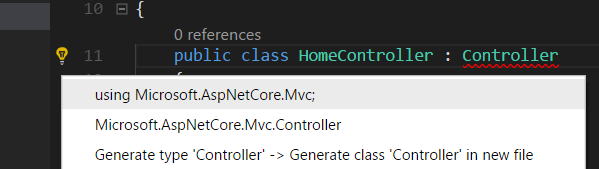

# Crear un proyecto ASP.NET Core

Si aun estas dentro del directorio que creaste para el programa Hello World, muévete fuera de la carpeta y dirigirte al directorio Documents :

```text
cd ..
```

A continuación, crea un nuevo proyecto con el comando`dotnet new`, esta vez con una parámetros extra:

```text
dotnet new mvc --auth Individual -o AspNetCoreTodo

cd AspNetCoreTodo
```

Este comando crea un nuevo proyecto utilizando la plantilla `mvc`,  y añade alguna características extras para la autenticación y la seguridad al proyecto. \(Esta parte la cubriré en el apartado de _Seguridad e Identidad_\)

Deberías comprobar como se han creado una series de nuevos ficheros en el directorio `AspNetCoreTodo `. Una vez que estas dentro el directorio con el comando`cd`, todo lo que tienes que hacer para ejecutar el proyecto es escribir el siguiente comando en tu terminal:

```text
dotnet run

Now listening on: http://localhost:5000
Application started. Press Ctrl+C to shut down.
```

En esta ocasión en lugar de mostrar el texto por pantalla y finalizar la ejecución del programa, este programa arranca un servidor web y se queda esperando peticiones en el puerto 5000.

Abre tu navegador web favorito e introduce esta direccion`http://localhost:5000`. Deberías ver la pagina por defecto que nos crea la plantilla de ASP.NET Core, lo que significa que tu proyecto se esta ejecutando correctamente! Cuando estés listo, pulsa Ctrl-C en el terminal para finalizar la ejecución del programa.

## Las partes de un proyecto ASP.NET Core

La plantilla`dotnet new mvc` crea una gran variedad de ficheros y directorios por ti. A continuación se detallan los mas importantes que se generan sin ninguna tipo de configuración:

* Los ficheros **Program.cs** y **Startup.cs** configuran e inicializan el servidor web y el pipeline de ASP.NET Core. La clase `Startup` es donde podrás añadir el middleware encargado de manejar y modificar todas las peticiones entrantes, ademas es la encargada de servir cosas como el contenido estático o paginas de errores cuando las peticiones no son correctas. También es donde podrás añadir tus propios servicios al contenedor de inyección de código \(hablaremos mas adelante sobre ello\).
* Los directorios de **Models**, **Views **y **Controllers** contienen todos los componentes de la arquitectura Modelo-Vista-Controlador \(MVC\). En el próximo capitulo podrás explorar mas acerca de este aspecto.
* El directorio **wwwroot** contiene todo el código estático de la aplicación como puede ser CSS, JavaScript, e imágenes. Los ficheros que se encuentren dentro del directorio `wwwroot` serán servidos como contenido estático y por tanto podrán ser incluidos y minimizados automáticamente.
* El fichero **appsettings.json** contiene todos los ajustes de configuración que ASP.NET Core cargara en el arranque. Puedes utilizar este fichero para almacenar todos los strings necesarios para la conexión con la bases de datos u otro tipo de cosas que no quieras escribir directamente en el código fuente.

## Trucos para Visual Studio Code

Si finalmente te has decidido por Visual Studio Code \(o Visual Studio\) y es tu primera vez con él, aquí te dejo algunos consejos muy útiles para iniciarse:

* **F5 para ejecutar \(y hacer debug con puntos de ruptura\)**: Con el proyecto abierto, pulsa F5 para ejecutar el programa en modo **Debug**. El resultado es el mismo que ejecutar`dotnet run` desde el terminal, pero con la ventaja de poder añadir puntos de ruptura en tu código simplemente haciendo clic en el panel izquierdo del editor:


* **Bombilla para solucionar**: Si tu código contiene marcas rojas \(errores de compilación\), pon el cursor en el código que esta subrayado en rojo y acerca el cursor a la bombilla amarilla en el margen izquierdo. El menú de la misma te mostrara sugerencias típicas, como puede ser el caso de añadir un `using` a tu código:



* **Compilado rápido**: Utiliza el atajo de teclado`Command-Shift-B` o `Control-Shift-B` para ejecutar la tarea Build , la cual realiza la misma operación que el comando`dotnet build`.

## Un apunte acerca de Git

Si eres de lo que utiliza Git o GitHub para manejar tu código fuente, ahora es el momento para para crear un repositorio git en el directory del proyecto con el comando`git init` . Asegúrate de añadir el fichero`.gitignore` para ignorar los directorios`bin` y`obj`. La plantilla para Visual Studio disponible en el repositorio de GitHub \([https://github.com/github/gitignore](https://github.com/github/gitignore)\) funciona de maravilla.

Tenemos mucho que explorar por delante, así que vamos a comenzar a profundizar y crear una aplicación!

